### Normal Gaussian

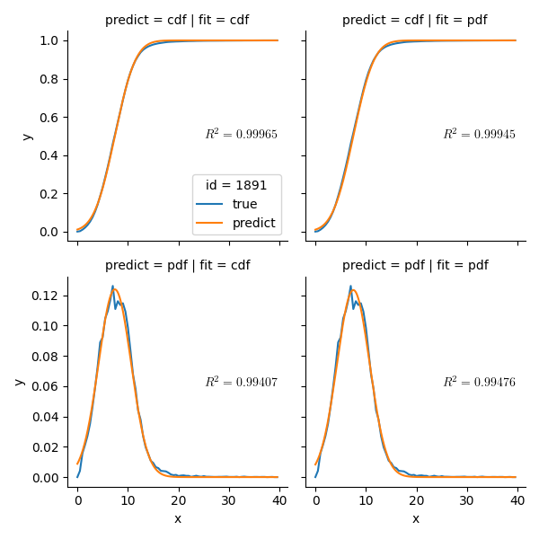

### Inverse Gaussian

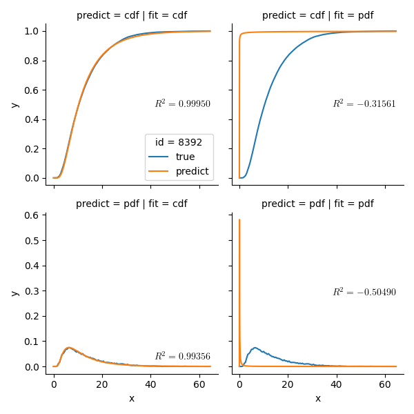

### Polynomial

### Rational

### Shifted Log Pearson III

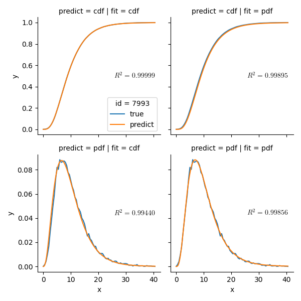

### Gamma

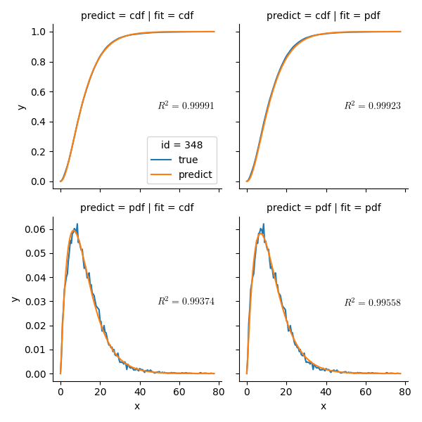

### Weibull

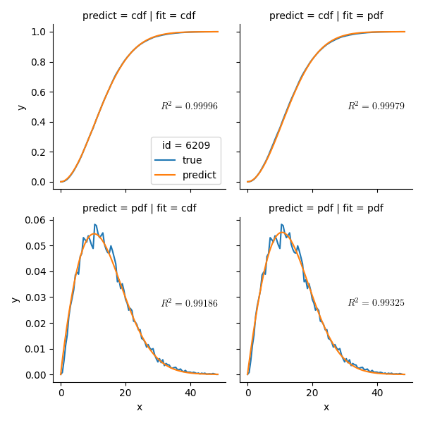

### Frechet

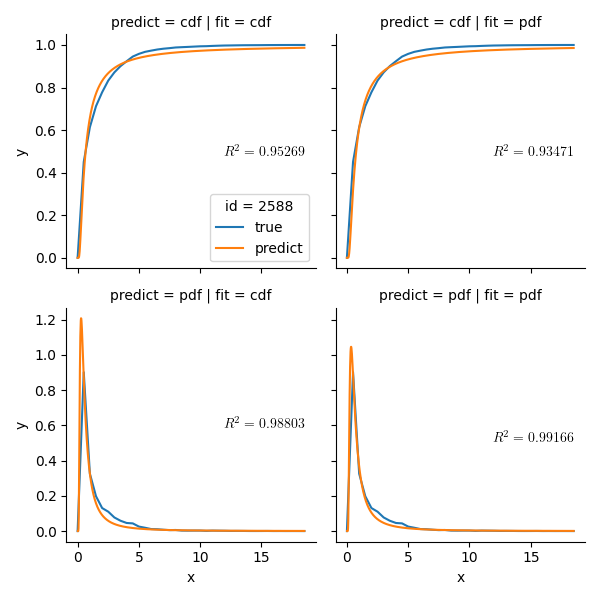

### Logistic

### Multistage

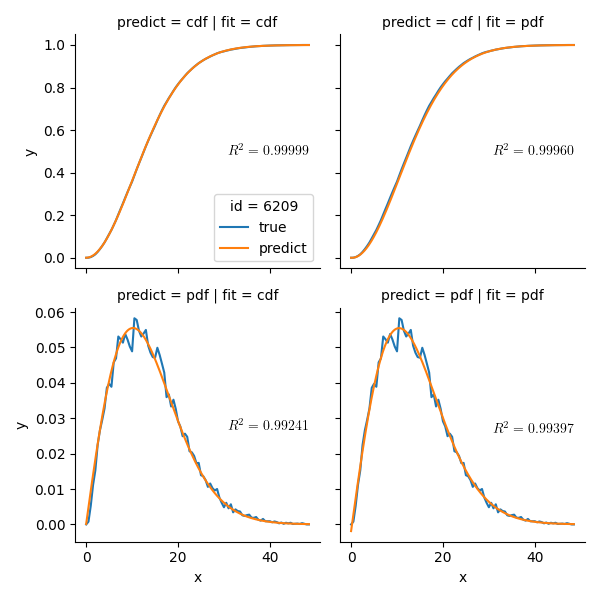

### Double Power

### Hill

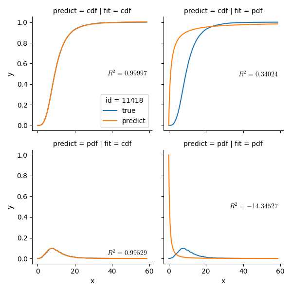

### Kumaraswamy

### Hoerl

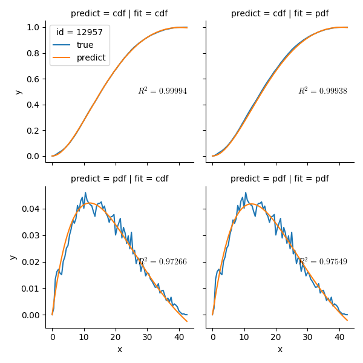

### Beta

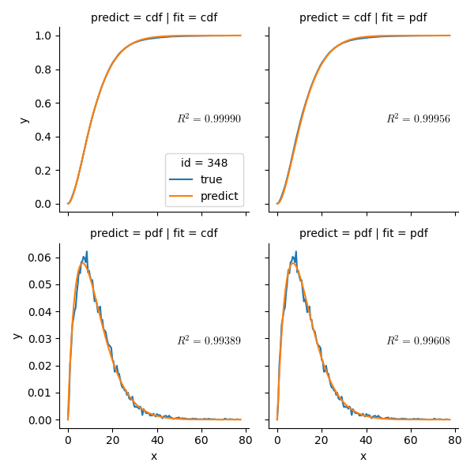

### Double Triangular

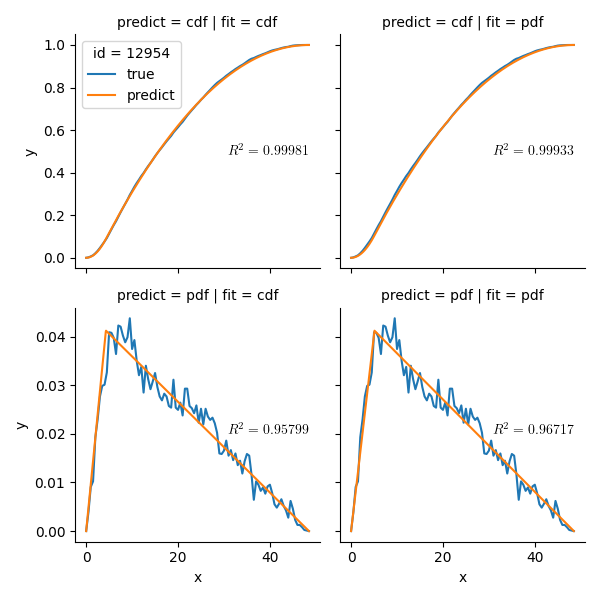
